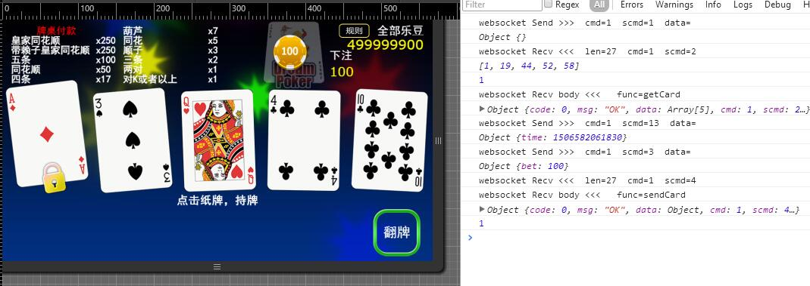
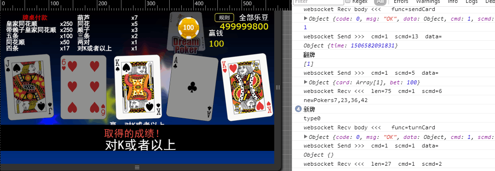
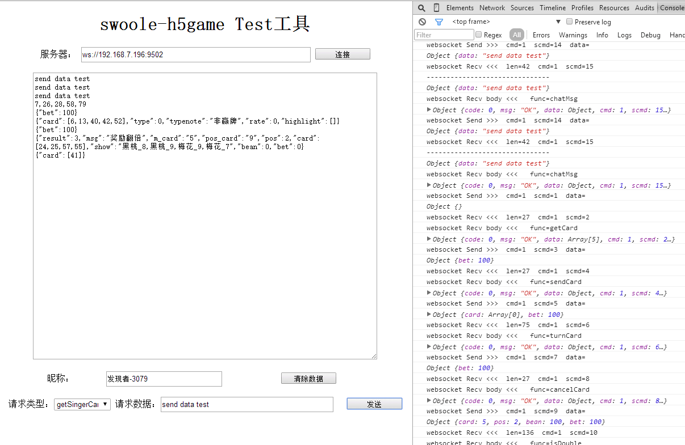

# swoole-game

* 基于Swoole扩展开游戏服务器框架
* 框架打包后使用方法请关注：**[swoole-game-framework](https://github.com/jxy918/swoole-game-framework)**
* 基于swoft框架实现的另一版本：**[swoft-game](https://github.com/jxy918/swoft-game)**
* 想关主游戏开发可以关注swoft-ddz斗地主：**[swoft-ddz](https://github.com/jxy918/swoft-ddz)**

### 一，概述

* 该框架主要用于开发游戏服务器，简化游戏前后端开发，框架主要实现了前后端，封包解包，协议解析，压缩，粘包，路由等功能，代码示例为h5游戏。
* 框架比较简单, 几乎不依赖外部源码库, 方便阅读和使用。
* 基本实现框架功能, 框架组件还不完善, 自己用到什么组件可以方便集成进来。 

 
### 二，示例图







 

### 三，特性

* 对websocket,http,tcp协议进行封装，异步处理任务
* 实现前后端二进制封包解包，采用的是msgpack扩展，msgpack对数据进行了压缩，并实现粘包处理, 服务器加入了protobuf支付，tcp有测试例子
* 数据采用固定包头，包头4个字节存包体长度，包体前2个字节分别为cmd(主命令字)，scmd(子命令字)，后面为包体内容
* 采用策略模式解耦游戏中的每个协议逻辑
* 实现定义游戏开发cmd(主命令字)和scmd(子命令字)定义，cmd和scmd主要用来路由到游戏协议逻辑处理
* 代码里有个JokerPoker类是一个款小游戏算法类，是一个示例，如示例图1,2,3,4
* 代码主要是用框架实现小游戏JokerPoker例子，服务端代码开源，客户端代码暂不开源，但是提供客户端交互测试工具，见示例图5。
* 可以方便的把JokerPoker范例去除，只使用框架功能定制开发开发自己的游戏功能


> 备注：注意此范例数字都是默认值， 未用到存储， 运行不需要数据库，数据库配置只是测试操作数据库用
        
   
### 四，环境依赖

>需要支持高版本swoole, 环境可以自行编译, 为了方便大家使用, 可以使用根目录提供的Dockerfile文件构建环境
    
* php 7.1及以上  
* swoole 1.9以上版本
* msgpack 
* protobuf 选择使用
    
    
### 五，开始使用
* 1，安装swoft
```
composer install
``` 

* 2，目录说明：

```
./bin 服务启动目录
./core 框架服务器核心代码
./lib 公共类库代码
./app 游戏协议逻辑处理代码
./conf 相关配置目录
./log  日志目录
./client 客户端交互测试工具
``` 
         
* 3，进入bin目录，启动服务器 ：

```
./game  start   启动服务 
./game  stop    关闭服务 
./game  reload   服务重载， 优雅载入， 不需要启动服务， 可以载入所修改的逻辑

``` 

>也可以直接用php命令行启动, 但是请确认启动之前， 杀死所有相关进程

```
php run.php

``` 

* 4，如果开启http服务器，其实websocket和http是同时开启的， 如果不想混在一起可以单独开启监听端口，http测试例子代码如下浏览器访问：

```
http://[ip]:[port]/HttpTest?aaa=bbb&ccc=ddd

```

* 5，如果开启了tcp服务器，测试例子在client目录下， 注意例子采用了protobuf，请安装，也可以改成msgpack，请自行修改
php执行一下就可以看到结果：

```
php tcp_client.php

```

* 6 ，H5游戏客户端代码由于公司限制，暂不开放， 但是提供了一个客户端交互测试工具，直接把client目录放入web服务器， 修改客服端配置文件配置websocket链接就能运行。

### 六，联系方式

* qq：251413215, 加qq请输入验证消息：swoole-game

### 七，备注

* 根目录增加docker运行环境(Dockerfile)， 可以直接执行下面的命令，创建镜像php_swoole, 环境增加php-protobuf支持 

```
docker build -t php_swoole .
```

